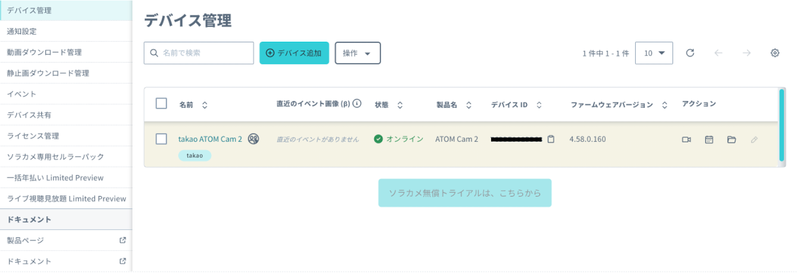

# 20250509_handson

## 1. 【事前準備】SORACOM アカウントの作成
SORACOM の IoT SIM を利用するには「SORACOM アカウントの作成」を行います。

以下、の手順を行ってください

[STEP 1: SORACOM アカウント (オペレーター) を作成する](https://users.soracom.io/ja-jp/guides/getting-started/create-account/)
※今回のハンズオンを行うだけであれば、支払い登録は不要で実施できます。

## 2. ソラカメをセットアップする
フォームにソラカメのIDを入力する
こちらにアクセスします。

https://console.soracom.io/sora_cam/shares

右上のあなたのATOMユーザーIDをクリップボードにコピーします。

こちらのサイトにアクセスします。
https://3ujmwrqppg6y7rdcw5oytihdt40csvsn.lambda-url.us-west-2.on.aws/form

こちらに必要項目を入力します。

デバイスIDは
会場風景：7CDDE9028E24

ソラカメの共有の申請を受理する
こちらから共有の申請を承認します。

https://console.soracom.io/sora_cam/shares

ソラカメが共有されたことを確認する
カメラが正常に動作しているか確認しましょう。

「ソラコムクラウドカメラサービス」 -> 「[デバイス管理](https://console.soracom.io/sora_cam/devices)」

デバイスの一覧表示で、先ほど登録したカメラがオンラインになっていることを確認します。

デバイスIDが重要な情報となります。

後で使うので、メモをしておくかいつでもここに戻ってこられるようにしておきましょう。

## 3. ハンズオン本編
こちらの手順で進めていきましょう！
https://zenn.dev/takao2704/articles/soracamimagetos3toawsservices